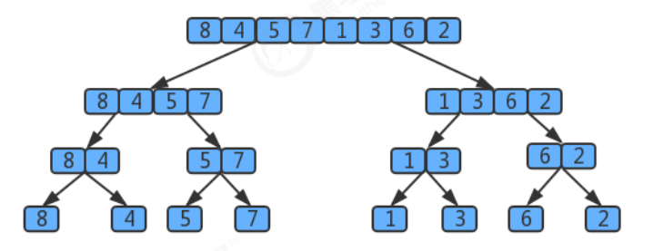

### _归并排序时间复杂度分析_

归并排序是分治思想的最典型的例子，上面的算法中，对 `a[lo...hi]` 进行排序，先将它分为 `a[lo...mid]` 和 `a[mid+1...hi]`
两部分，分别通过递归调用将他们单独排序，最后将有序的子数组归并为最终的排序结果。该递归的出口在于如果一个数组不能再被分为两个子数组，那么就会执行 `merge` 进行归并，在归并的时候判断元素的大小进行排序。

  用树状图来描述归并，如果一个数组有`8`个元素，那么它将每次除以`2`找最小的子数组，共拆`log8`次，值为`3`，所以
树共有`3`层,那么自顶向下第k层有`2^k`个子数组，每个数组的长度为`2^(3-k)`，归并最多需要`2^(3-k)`次比较。因此每层
的比较次数为 `2^k * 2^(3-k)=2^3`,那么`3`层总共为 `3*2^3`。
  
假设元素的个数为`n`，那么使用归并排序拆分的次数为`log2(n)`,所以共`log2(n)`层，那么使用`log2(n)`替换上面`3*2^3`中
的`3`这个层数，最终得出的归并排序的时间复杂度为：`log2(n)* 2^(log2(n))=log2(n)*n`,根据大O推导法则，忽略底数，最终归并排序的时间复杂度为`O(nlogn)`;

**归并排序的缺点**：
需要申请额外的数组空间，导致空间复杂度提升，是典型的以空间换时间的操作。
